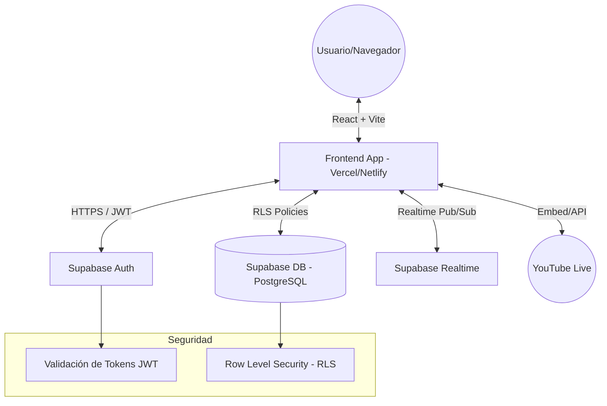

# 🏗️ Manual de Arquitectura y Seguridad
**Escuelita Lo Miranda FC - Plataforma Profesional**

Este documento detalla la infraestructura técnica que garantiza la seguridad, velocidad y robustez del sistema.

## 1. Esquema de Arquitectura

El sistema utiliza una arquitectura **Decoupled Frontend-Backend** basada en servicios en la nube de alta disponibilidad.

## 2. Seguridad y Robustez

### Autenticación via JWT
El sistema utiliza **JSON Web Tokens (JWT)**. 
- **Inviolable**: Cada token está firmado digitalmente. No se puede suplantar la identidad de un usuario sin la clave privada del servidor.
- **Sin Estado**: No guardamos sesiones pesadas en el servidor, lo que hace que la app sea rápida y no consuma memoria innecesaria.

### Row Level Security (RLS) - "Seguridad a nivel de fila"
> [!IMPORTANT]
> A diferencia de sistemas antiguos donde el código de la web controla el acceso, aquí la **Base de Datos** es la que decide. Incluso si alguien intentara hackear el código del navegador, la base de datos rechazaría cualquier comando que no pertenezca al usuario autenticado.

## 3. Capacidad y Escalabilidad

El sistema está diseñado bajo el paradigma de **Alta Disponibilidad**:

| Métrica | Capacidad Estimada | Nota |
| :--- | :--- | :--- |
| **Usuarios Concurrentes** | 1,000 - 5,000+ | El límite está dictado por el plan de Supabase (PostgreSQL maneja conexiones masivas). |
| **Peticiones por Segundo** | ~2,000 | Respuestas ultra-rápidas gracias a la infraestructura global de Supabase. |
| **Almacenamiento** | Escalable dinámicamente | Las fotos e imágenes se sirven vía CDN (Content Delivery Network). |

## 4. El Módulo "Live" (Streaming)

El sistema de "Live" funciona con una tecnología llamada **Websockets (Realtime)**:

1. **Configuración**: El admin ingresa un ID de video de YouTube.
2. **Propagación Instantánea**: En milisegundos, Supabase envía una señal a **todos** los navegadores abiertos.
3. **Banner Dinámico**: El código que corregimos detecta esta señal y muestra el banner de "¡EN VIVO!" sin que el usuario tenga que refrescar la página.

> [!TIP]
> Esta misma tecnología de tiempo real es la que se usa para las notificaciones y las fotos de perfil, eliminando la necesidad de recargar la web constantemente.
